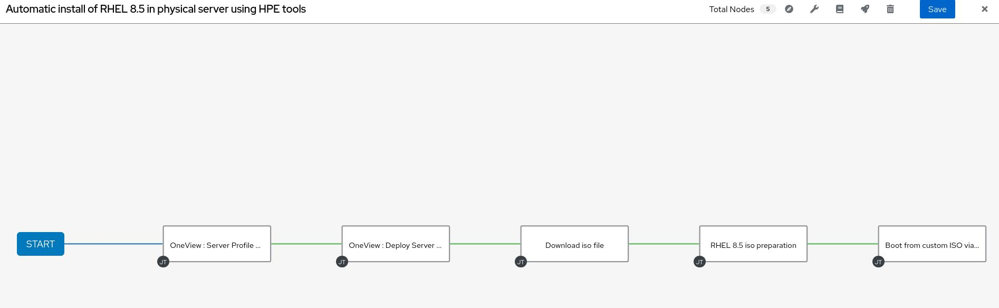

# Automating HPE OneView with Ansible Automation Platform 2 workshop

## Introduction
The purpose of this Git post is to show how to automate the deployment of a Red Hat Enterprise Linux (RHEL) operating system on HPE hardware taking advantage of HPE OneView software and Ansible Automation Platform 2.1.
Before we begin, I want to let you know this workshop is an update on the one [built by my colleague Markus](https://github.com/mschreie/hpe_oneview_ansible_workshop). Thus, there are some information which I won't write again, instead I'll redirect to his Git entry.

## Which steps are we exactly demonstrating here?

We'll be showing the following tasks:

1. [Installing Ansible Automation Platform 2.1](#1--ansible-automation-platform-21-installation)
2. [Creating and working with Execution Environments](#2--creating-and-working-with-execution-environments)
3. [Automate working with HPE OneView server profiles](#3--automate-working-with-hpe-oneview-server-profiles)
4. [Automate the creation of a custom ISO for unattended RHEL installation](#4--automate-the-creation-of-a-custom-iso-for-unattended-rhel-installation)
5. [Automate a physical server booting from our custom ISO through HPE iLO](#5--automate-a-physical-server-booting-from-our-custom-iso-through-hpe-ilo)
4. [Create a Workflow for automating the whole process](#6--create-a-workflow-for-automating-the-whole-process)

Last but not least, there is also a section for [conclusions](#Conclusions) at the end of this document.

As you can see, there are a few things we're going to see here. Markus already explained how to do most of this things with Ansible 1.2, so we're going to focus on the new stuff: Ansible Automation Platform 2 installation, Ansible Execution Environments creation and use, writting the yaml files for the automated creation of the custom ISO and workflow creation.

## What do we need for this workshop?

We're going to asume you have three systems deployed, working and connected between themselves through the network.

1. HPE OneView appliance: it could be virtual or it could be a hardware appliance if you have an HPE Synergy available for you. In our specific use we'll use the Composer embeded in a Synergy appliance. If you need to install OneView as a VM, please refer to HPE OneView documentation. Remember that OneView will need **at least one physical server** in which we'll deploy RHEL.
2. Ansible Controller virtual machine: you can deploy Ansible Controller on top of a server (physical or VM) or on top of OpenShift (k8s), in our case we're going to show how to install it on a server. We're using a RHEL 8.5 (minimal install) virtual machine with 4 vCPU, 8 GB RAM and 150 GB HDD (if you have any doubt check the requirements in the [official documentation](https://access.redhat.com/documentation/en-us/red_hat_ansible_automation_platform/2.1/html/red_hat_ansible_automation_platform_installation_guide/planning-installation#red_hat_ansible_automation_platform_system_requirements)).
3. RHEL bastion machine: a RHEL virtual machine we'll use to create the ISO file for the automated installation of RHEL. For the bastion host we are usign a RHEL 8.5 (minimal install) virtual machine with 2 vCPU, 4 GB RAM and 40 GB HDD.

And that's all, quite simple :)

## Workshop tasks

### 1.- Ansible Automation Platform 2.1 installation

Ansible Automation Platform 2 comes with a lot of new features and changes which enhance Ansible's capabilities, you can check some of those in this [link](https://www.ansible.com/blog/introducing-ansible-automation-platform-2). One of those changes is related to naming: what we used to call Ansible Tower is now known as Ansible Controller. I want to state this clearly, Ansible Controller isn't just Ansible Tower with a new name, it's also a new major version with tons of new stuff.

Now, going back to our workshop, we're counting that you already have your RHEL 8.5 VM installed. Once you have that we'll follow the installation instructions from the [official Red Hat documentation](https://access.redhat.com/documentation/en-us/red_hat_ansible_automation_platform/2.1/html/red_hat_ansible_automation_platform_installation_guide/index). Here we'll summarize the whole proccess and explain it.

First thing you need to do is attach an Ansible subscription:
You need to use subscription-manager to attach an Ansible and RHEL subscription. Login with your account:

```
subscription-manager register
```

Then list all the subs you have available and copy the pool ID from the Ansible sub:

```
subscription-manager list --available
```

Attach your Ansible sub to this host. "xxxxxxxxxxxxxxxxxxxxxxxx" is the pool id you copied in the previous step:

```
subscription-manager attach --pool=xxxxxxxxxxxxxxxxxxxxxxxx
```

Once you have activated your subscription you need to enable the appropiate repos on yous system, this will allow you to install all the packages we need for this workshop.
First add the ansible automation platform 2.1 repos:

```
subscription-manager repos --enable=ansible-automation-platform-2.1-for-rhel-8-x86_64-rpms
```

Then install the required packages:

```
dnf install -y ansible-builder ansible-runner ansible-core
```

Download the installer file or upload it through scp if you already have it in your computer:

```
curl -o ansible-automation-platform-setup-2.1.0-1.tar.gz 'https://access.cdn.redhat.com/content/origin/files/sha256/31/31e4b2a4df47cd81fee8aa4280cb5e2217a7534289dc26a4e4354dab5c25f131/ansible-automation-platform-setup-2.1.0-1.tar.gz?user=46606641cfc6a3ae593c2684110d9148&_auth_=1640784682_8b89c99390fc9eba9bc0d4a714e1e7b0'
```
Note you might need to update the link, you can find it at [Red Hat customer portal](https://access.redhat.com/downloads/content/480/ver=2.1/rhel---8/2.1/x86_64/product-software).

Then, in Ansible Controller, unzip the file:

```
tar xvzf ansible-automation-platform-setup-2.1.0-1.tar.gz
```

Change your working directory to the unzipped folder:

```
cd ansible-automation-platform-setup-2.1.0-1
```

You should see the collections, group vars and licenses directories; the inventory and README.md text files and the setup.sh executable.

Edit the inventory file using vi or other text editor:

```
vi inventory
```

For our installation, which is kind of basic, we'll use the following inventory file:

```
# Automation Controller Nodes
[automationcontroller]
localhost ansible_connection=local

[automationcontroller:vars]
peers=execution_nodes

# Execution Nodes
[execution_nodes]

[automationhub]

[database]

[servicescatalog_workers]

# Single Sign-On
[sso]

[all:vars]
admin_password='YOUR-ADMIN-PASSWORD'

pg_host=''
pg_port=''

pg_database='awx'
pg_username='awx'
pg_password='YOUR-PG-PASSWORD'
pg_sslmode='prefer'  # set to 'verify-full' for client-side enforced SSL

# Execution Environment Configuration
# Credentials for container registry to pull execution environment images from,
# registry_username and registry_password are required for registry.redhat.io
registry_url='registry.redhat.io'
registry_username='YOUR-REDHAT-CDN-USER'
registry_password='YOUR-REDHAT-CDN-PASSWORD'

# Receptor Configuration
#
receptor_listener_port=27199

# Automation Hub Configuration
#

automationhub_admin_password=''

automationhub_pg_host=''
automationhub_pg_port=''

automationhub_pg_database='automationhub'
automationhub_pg_username='automationhub'
automationhub_pg_password=''
automationhub_pg_sslmode='prefer'

# Single-Sign-On configuration
sso_console_admin_password=''
```

Now you should be able to run the setup script and finish Ansible Controller installation, but there is a [Red Hat documented known issue](https://access.redhat.com/solutions/6417471) which we are going to avoid before we run the installation process.
This issue is caused when the awx user doesn't have the right subuid and subgid configured. In order to check if you have the right configuration run the following commands (we're also showing the expected output here):

```
# grep awx /etc/subuid
awx:231072:65536
```
```
# grep awx /etc/subgid
awx:231072:65536
```

If you don't have the outputs shown above you have to set the right subuid and subgid for awx user. To do so run the following commands:

```
echo 'awx:231072:65536' >> /etc/subuid
```

```
echo 'awx:231072:65536' >> /etc/subgid
```

Once we've avoided the known issue, we can run the setup.sh file. We do recommend taking a snapshot of the virtual machine before running this process, this would allow you to go back in time in case something goes wrong.
Run the setup process:

```
./setup.sh
```

This will take some time, go grab a coffee!

Once it's finished you can just go to a browser from a computer with access to the network and type the IP address or FQDN of your Ansible Automation Platform host. Login with 'admin' user and the password you entered in the inventory file.

We'll finish the installation process in the GUI. Once the setup script has finished, use a browser to access the IP address or FQDN of your Ansible Controller host. Login with 'admin' user and the password you entered in the inventory file.

As this is the first time the admin logs into the platform you need to follow three simple steps.
First you need to login to Red Hat CDN with your account:


Then you need to choose a valid subscription from all of those you have available:


Last you have to accept the End User Agreement and we recommend to check the boxes for the use of Red Hat Insights and User Analytics:


_Et voilá!_ You have finished the installation of Ansible Controller :-)

### 2.- Creating and working with Execution Environments

> Remember! If you already know what are Execution Environments and how to build them through _ansible-builder_ you can skip this whole section as we provide the Execution Environments already build via ghcr.io, you can find them publicly available [here](https://github.com/pablo-preciado/hpe_oneview_ansible2.1_workshop/pkgs/container/hpe_oneview_ansible2.1_workshop).

#### 2.1.- Introduction to Execution Environments

Ansible Automation Platform 2 introduces the use of Automation Execution Environments, there are some really [good articles explaining what it's all about](https://www.redhat.com/en/technologies/management/ansible/automation-execution-environments), but I'll try to summarize it for the purpose of this workshop.

Ansible 1.2 was using python virtual environments, each virtual environment could have different dependencies, and this was really helpful because some automation modules could need different versions of the same python SDK. For example, imagine you want to automate HPE OneView and Red Hat Openshift but the automation modules for these softwares require different versions of Ansible Core (this is not the case, just an example), now you could use a different python environment for running HPE OneView modules and another one for running Red Hat OpenShift ones. So, as you can see, python virtual environments are really useful, but Red Hat worked hard with the community to bring all this features and more in an even easier way, this new way is what we call Execution Environments.

Now, what exactly is an Execution Environment? It's just a container with all the dependencies needed for running a specific automation job. So basically every job run by Ansible will need to run inside a container now. This allows for much better management and flexibility as we can take advantage of all the tools available for containers (such as a great variety of container registries) and avoid the complexity of working with python virtual environments as Execution Environments don't require any python knowledge nor being set up at remote sites/locations.

So, do I need to know how to deal with containers? Not really, it's convenient for you to have a basic knowledge on how containers work, but Red Hat has made a tool available for everyone who wants to create an Execution Environment (a container) in a very simple way. This tool is called _ansible-builder_ and we'll now see how to use it to create the Executions Environments we need for this workshop (in case you'd like to access more detailed information refer to the [official documentation](https://ansible-builder.readthedocs.io/en/stable/))

#### 2.2.- Creating the Execution Environments for our workshop

For this Workshop we could use a single Execution Environment, but for the shake of learning and demonstrating how easy it is to have several of them we'll be using 2 of them:
 * OneView Execution Environment: this Execution Environment will be used for all the OneView and iLO automations, so basically for everything related to HPE software.
 * Bastion Execution Environment: we will be using a Bastion host for creating our custom ISO file, this Execution Environment will have all the dependencies for running those.

As you can see, our environment is quite simple and we could put everything together in a single Execution Environment, but we wanted to demonstrate how we can have as many Execution Environment as needed without compromising simplicity of management and operation. Having more Execution Environments would also simplify everything in case of having the need for troubleshoot anything.

Before we begin, remember we installed the _ansible-builder_ packages as the first step of the Ansible Controller installation, we're going to use the Controller host to run the tool and creating our Execution Environments, but this could be done in any other host we have available as we're going to upload the container images to a container registry.

If for whatever reason you didn't install ansible-runner, just run the following command:

```
dnf install ansible-builder -y
```

To create an Execution Environment using ansible-builder we need to create three files: one yaml file with the instructions for building the Execution Environment, one yaml file with the Ansible Collections we want to be installed inside the Execution Environment and one txt file with all the python packages we want to be installed inside the Execution Environment.
But, how do we know which collections and python packages we need? Well, we now we want to automate OneView, so Red Hat gives us all the information we need through the [Automation Hub](https://console.redhat.com/ansible/automation-hub), there we can search for the HPE OneView collections and see what collections and packages we need to install. Note a valid Ansible subscription is needed for accessing Automation Hub.

With all this information we're now ready to build our Execution Environment. First lets create a directory, cd into it and create the yaml file with the instructions for creating the Execution Environment:

```
# mkdir /tmp/OneView-ExEnv
# cd /tmp/OneView-ExEnv
# vi execution-environment.yml
```

Feel free to install and use other text editors if you want.

For this OneView Execution Environment we need to tell ansible-builder where to find the needed ansible collections and python packages, but as we've seen in the [OneView python SDK documentation](https://github.com/HewlettPackard/oneview-python) we also need to define the PYTHONPATH environment variable. This means our file will look like this:

```
---
version: 1

dependencies:
  galaxy: requirements.yml
  python: requirements.txt

additional_build_steps:
  append:
    - ENV PYTHONPATH=/usr/libexec/platform-python
```
As you can see in the dependencies section, this build uses two other files. Let's look at those.
First the file _requirements.yml_ will define the Ansible Collections installed in the container. First let's create the file:

```
vi requirements.yml
```

Fill it with the required collections:

```
---
collections:
  - hpe.oneview
  - community.general
```
Then, the file _requirements.txt_ will define the python packages installed inside the container:

```
vi requirements.txt
```

Fill the file with the required modules:

```
hpICsp
hpeOneView
python-hpilo
python-ilorest-library
psutil
```
Everything is ready for building the Execution Environment, let's do it!

Before you create your containers you'll need to login to _registry.redhat.io_ as ansible-builder takes the base image from there in order to build the Execution Environments.

```
podman login registry.redhat.io
```
Use your Red Hat CDN username and password.

Remember we're using relative paths, so we need to be located in our /tmp/OneView-ExEnv directory. Run the following command:

```
ansible-builder build -f execution-environment.yml -t oneview-ee:1
```

With the _f_ option we're specifying the file used to build the execution environment and with _t_ option we're telling ansible-builder what tag we want to use for that container.

Once it's been created you can see your container listed among the podman images. Run the following command and look for the image of your container:

```
podman images
```

We just created the Execution Environment we're going to use for the automation jobs related to HPE software (OneView and iLO), but we're going to create another Execution Environment for working with the Bastion Host. We could simply include all the collections and python packages in a single Execution Environment, but we want to demonstrate how easy it is to work with different Execution Environments (beware that working with more Executions Environments scales much better when working with bigger environments and makes everything easier to troubleshoot, so my personal recommendation is to build everything as modular as possible).

Lets build the Bastion Host Execution environment. First, create a new working directory and the files for the new Execution Environment:

```
# mkdir /tmp/BastionHost-ExEnv
# touch execution-environment.yml requirements.yml requirements.txt
```

Use vi or other text editors to fill the files.
Fill the _execution-environment.yml_ file:

```
---
version: 1

dependencies:
  galaxy: requirements.yml
  python: requirements.txt
```

Then _requirements.yml_:

```
---
collections:
  - ansible.posix
```

Lastly, _requirements.txt_:

```
psutil
```

Now you can build the Bastion Host Execution Environment:

```
ansible-builder build -f execution-environment.yml -t bastionhost-ee:1
```

The recommended way of moving forward would be to upload the containers to a container registry. In our case, we're going to use the GitHub Container Registry and we are making those [images publicly available](https://github.com/pablo-preciado/hpe_oneview_ansible2.1_workshop/pkgs/container/hpe_oneview_ansible2.1_workshop) (you can use quay.io or any other registry if you want).
First log into the container registry:

```
podman login ghcr.io
```

Before you upload your container images you might need to include ghcr.io to the qualified images file:

```
vi /etc/containers/registries.conf.d/force-fully-qualified-images.conf
```

The content of the file should look as follows:

```
unqualified-search-registries = ["ghcr.io"]
```

Now push your local images to the container registry:

```
podman push localhost/bastionhost-ee:1 ghcr.io/pablo-preciado/hpe_oneview_ansible2.1_workshop:bastion-ee
```

```
podman push localhost/oneview-ee:1 ghcr.io/pablo-preciado/hpe_oneview_ansible2.1_workshop:oneview-ee
```

Remember, you can directly [download the Execution Environments images through Git Hub Container Registry (ghcr.io)](https://github.com/pablo-preciado/hpe_oneview_ansible2.1_workshop/pkgs/container/hpe_oneview_ansible2.1_workshop), those images are linked to this GitHub repository.

#### 2.3.- Basic troubleshooting for your images

This is not necessary but you can check if all the dependencies are installed in your container with podman (this could be useful if you need to troubleshoot something). If you want to do so, run the following command:

```
podman run --rm -it localhost/oneview-ee:1 /bin/bash
```

This command will run an interactive container using the oneview-ee:1 image we created before and will allow you to run commands inside the container. You can check which versions of ansible, python packages and collections were installed. Run the following commands inside the container and take some time to look at the outputs:

```
pip freeze | grep hpeOneView
```
```
pip freeze | grep hpICsp
```
```
pip freeze | grep python-hpilo
```
```
pip freeze | grep python-ilorest-library
```
```
pip freeze | grep psutil
```
```
ansible-galaxy collection list | grep hpe.oneview
```
```
ansible-galaxy collection list | grep community.general
```
```
ansible --version
```
```
echo $PYTHONPATH
```
As you can see, the configuration is the one we expected. This process will also show exactly which versions of each package is installed, thus being helpful for  a possible troubleshooting situation.

You can follow a similar process with the other Execution Environments, just change the image on the _podman run_ command.

### 3.- Automate working with HPE OneView server profiles

#### 3.1.- Introduction

In this section we'll show how to create and apply a OneView Server Profile to a OneView-managed physical server, this will guarantee we have the right hardware and firmware configuration for our RHEL installation.

We'll be assuming you have a basic understanding on how Ansible Controller works as well as how OneView managed Server Profiles, if you need an introduction on how Ansible and OneView can work together I'd recommend to take a look at [exercise 4 of Markus workshop](https://github.com/mschreie/hpe_oneview_ansible_workshop/blob/master/exercises/getting_started_with_hpe_oneview.md).

#### 3.2.- Preparation of the environment

There are a few things we have to set up before we can run the automations themselves:
 * Create GitHub credentials
 * Create GitHub Container Registry credentials
 * Create HPE OneView Execution Environments
 * Create a new Project
 * Create OneView Credentials Type and OneView Credentials
 * Create iLO Credentials Type and iLO Credentials
 * Create a dynamic inventory from Git Hub

After we set up all these items we can proceed to create the Job Templates.

Lets begin **creating GitHub credentials**, these credentials are needed to work on your Github account in order to download the repository. If your project is public, you won't need to specify any credentials.

Navigate to Resources > Credentials > Add, once you're there fill the form with the following data:
 - Name: Git repo credentials
 - Organization: Default
 - Credential Type: Source Control
 - Username (optional): your GitHub username
 - Password (optional): your GitHub password


We also need to connect Ansible Controller to a **container registry** (we use the Git Hub Container Registry) from which we'll get Execution Environment images. Go to Resources > Credentials > Add and fill it as follows:
 - Name: Git Hub Container Registry
 - Organization: Default
 - Credential Type: Container Registry
    - Auth URL: ghcr.io
    - Username: your GitHub username
    - Password: your Github token
    - Check the "Verify SSL" box


Now let's add the **OneView execution environment** we created previously and pushed it to GitHub Container Registry. Go to Administration > Execution Environment > Add, then fill the form as follows:
 - Name: OneView Execution Environment
 - Image: ghcr.io/pablo-preciado/hpe_oneview_ansible2.1_workshop:oneview-ee
 - Pull: Always pull container before running
 - Organization: Default
 - Registry Credential: Git Hub Container Registry


Now you we can create a **Project**, navigate to Resources > Projects > Add, fill the form with the following data:
 - Name: HPE OneView Workshop
 - Organization: Default
 - Default Execution Environment: OneView Execution Environment (be aware that we can overwrite the Execution Environment used in each Job Template, so the one we choose here is not so important)
 - Source Control Credential Type : Git
    - Source Control URL: https://github.com/pablo-preciado/hpe_oneview_ansible2.1_workshop
    - Check the following boxes: clean, delete and update revision on launch
     


Of course, if we want to automate OneView we're going to need OneView credentials, but Ansible doesn't have that type of credentials so first we need to create the **OneView Credential Type** and then we can create the credentials.

Go to Administration > Credential Types > Add and create the Oneview Credentials Type with the following information:
 - Name: HPE OneView Credentials
 - Input configuration:
   ```
   fields:
     - id: username
       type: string
       label: HPE Oneview username
     - id: password
       type: string
       label: HPE Oneview password
       secret: true
     - id: domain
       type: string
       label: HPE Oneview Domain
     - id: api_version
       type: string
       label: HPE Oneview Api version
   required:
    - username
    - password
    - domain
    - api_version
   ```
 - Injector configuration:
   ```
   extra_vars:
     oneview_domain: '{{ domain }}'
     oneview_password: '{{ password }}'
     oneview_username: '{{ username }}'
     oneview_apiversion: '{{ api_version }}'
   ```


This allows us to create the **OneView credentials**, navigate to Resources > Credentials > Add and fill it with your OneView instance data:
 - Name: HPE Oneview creds
 - Credential Type: HPE Oneview Credentials
 - Type Details:
    - HPE Oneview username: your OneView username
    - HPE Oneview password: your OneView password
    - HPE OneView Domains: your OneView domain
    - HPE Oneview Api version: 2800


We need to **create iLO credentials** after creating the iLO Credentials Type, the same way we did with OneView.

Go to Administration > Credential Types > Add and **create the iLO Credentials Type** with the following information:

 - Name: HPE iLO Credential Type
 - Input configuration:

```
fields:
  - id: username
    type: string
    label: HPE ILO username
  - id: password
    type: string
    label: HPE ILO password
    secret: true
```
 - Injector configuration:

```
extra_vars:
  ilo_password: '{{ password }}'
  ilo_username: '{{ username }}'
```


Now you can **create iLO Credentials** with your user and password. Navigate to Resources > Credentials > Add:
 - Name: HPE iLO credentials
 - Credential Type: HPE iLO Credential Type
 - Type Details:
    - HPE iLO username: your iLO username
    - HPE iLO password: your iLO password


#### 3.3.- Working with Inventory

We need to let Ansible Controller know which host it's managing so it can contact those specific hosts, thus we're going to **create an inventory**, we could manually input each host to the inventory but instead of that we'll create an inventory file stored in GitHub which will allow us to scale better.

This file will have the following content for our specific use case:

```
localhost    ansible_connection=local
bastion_host ansible_host=10.6.80.10
oneview_host ansible_host=10.6.25.10

[target_hosts]
target1    ansible_host="1.2.3.4"   ov_hardware="Demo1_Rack12_Frame3, bay 5" ilo_ip=10.6.25.137
target2    ansible_host="1.2.3.5"   ov_hardware="Demo1_Rack12_Frame3, bay 6" ilo_ip=10.6.25.138
```

Then we can configure Ansible Controller to get all the data from there, go to Resources > Inventories > Add and fill it as follows:
 - Name: Workshop inventory from GitHub
 - Organization: Default


Inside the just created inventory go to the Sources tab > Add, fill with this information:
 - Name: Inventory file from Github
 - Execution Environment: OneView Execution Environment
 - Source details
   - Project: HPE OneView Workshop
   - Inventory fiel: inventory/hosts
   - Check the following boxes: Overwrite, Overwrite variables, Update on launch


That way Ansible Controller gets the Inventory from a file in GitHub which we can easily modify and update. There are some othe ways of managing Inventories, but for the shake of simplicity we'll be using this file in this Workshop.

#### 3.4.- Creating and applying a OneView Server profile through Ansible

Now it's time to create the **Job Templates**. We're going to create two Job Templates, the first one will use the hpe_oneview_create_srv_templ.yml file and is the one in charge of creating a new server template in OneView, then we'll create a Job Template using the hpe_oneview_deploy_srv_prof.yml file which will apply the created template to the physical server we've defined in our variables file.

Go to Resources > Template > Add and fill the form as follows:
 - Name: OneView : Server Profile Template Creation
 - Inventory: Workshop Inventory from GitHub
 - Projects: HPE OneView Workshop
 - Playbook: 1_hpe_oneview_create_srv_templ.yml
 - Credentials: HPE OneView Credentials; HPE ILO Credential
 - Execution Environment: OneView Execution Environment

We do not need privilege escalation or any other option.

This Job Template will use a very blunt Playbook which creates a Server Profile Template.
In the real world we would work with a Jinja2-Template which gets customized with parameters instead of hardcoding everything into the playbook directly. But for this to be feasable we need to agree jointly on some predefined structure.
Take this playbook as a "proof of concept" level.


Create another Job Template for applying the server template that we will create with the previously created Job Template. Follow the same process, this time use this inputs:
 - Name: OneView - Deploy Server Template
 - Inventory: Workshop Inventory from GitHub
 - Projects: HPE OneView Workshop
 - Playbook: 2_hpe_oneview_deploy_srv_prof.yml
 - Credentials: HPE OneView Credentials
 - Execution Environment: OneView Execution Environment

Again, we do not need privilege escalation or any other option.
For this last Template Job to work the hardware needs to be unassigned to a profile template in OneView.


And **finally, you can now run your two templates**!
To do so you need to go to Resources > Templates and click on the little rocket next to the Job Templates. Remember you need to create the server template before deploying it.
 - First Start with : Server Profile Template Creation
 - Once successful you can launch : Deploy Server Template

Review output in the log window
Review in Oneview console what is happening

### 4.- Automate the creation of a custom ISO for unattended RHEL installation

#### 4.1.- Introduction

In this section we will create all the steps needed to create a custom RHEL 8.5 ISO file, this ISO file will manage the automated installation of the operating system.

We use a kickstart file (ks.cfg) for configuring the RHEL machine (hostname, dhcp or static, etc), all the details on the process we followed can be found in [this Red Hat knowledge base article](https://access.redhat.com/solutions/60959). You'll see there is a lot of room for improvement in our ks.cfg file and the variables we use, this is because we built this workshop for demonstrating purposes, in a real world scenario we would define many more variables giving the automation a wider range of possibilities on the RHEL configuration.

All this process is done in a bastion host (which is just an auxiliary RHEL8 virtual machine), there is some pre and afterwork we need to automate in the bastion host to make sure everything runs as expected everytime we use these automation jobs:
 - Bastion host ansible user creation: we are going to create a user that Ansible will use for all the automations as we don't want to use the root user.
 - Bastion host preparation: we make sure Bastion hosts have the packages, directories and services we need for running our automated process.
  - Custom ISO preparation: here is where all the process of creating a custom ISO file is done

#### 4.2.- Prerequisites

Before we run any of these jobs we need to indicate to the Ansible Controller how to access the Bastion host, so we're going to **create credentials for this Bastion machine**.
As the Bastion hosts is a linux (RHEL 8) machine we don't need to create a new credential type, that's already on Ansible out of the box, so we just need to navigate to Resources > Credentials > Add and fill the form:
 - Name: Ansible User - Machine credential
 - Credential type: Machine
 - Username: ansible
 - Password: We injected a password via bastion host preparation yaml file which need to be put here


You also need to create the Bastion host Execution Environment. Now let's add the **Bastion execution environment** we created previously and pushed it to GitHub Container Registry. Go to Administration > Execution Environment > Add, then fill the form as follows:
 - Name: Bastion Execution Environment
 - Image: ghcr.io/pablo-preciado/hpe_oneview_ansible2.1_workshop:bastion-ee
 - Pull: Always pull container before running
 - Organization: Default
 - Registry Credential: Git Hub Container Registry

#### 4.3.- Automating the creation of a custom ISO file for unmanaged installation of RHEL8 via Ansible

In this section we're going to show how to create the Job Templates for preparing the Bastion host, downloading the original ISO file from Red Hat CDN, preparing a custom ISO for an unattended installation and cleanup of the Bastion host.

The first Job Template will **create the _ansible_ user at the bastion host**. The _ansible_ user is the one we will be using for the following templates, so we need it to have root access, the problem is that, in order to give this kind of access to this user, we will need to provide Ansible Controller with root access to the bastion host, otherwise the automation will fail. As we don't want to store root credentials in Ansible Controller (even if the password would be encrypted), our recommendation is to run the Bastion host ansible user creation playbook through the command line because this way you can manually provide the root user and password.

So we recommend accessing the Ansible Controller through CLI using _ansible-playbook_ command. But, before running it, you need to add the Bastion host fingerprint to your known_hosts file to manage it.

```
ssh-keyscan -H <BASTION-HOST-IP> >> ~/.ssh/known_hosts
```

Now you can run the playbook:
```
ansible-playbook -i inventory/hosts --ask-pass 3_bastion_host_ansible_user_creation.yml
```
That command is telling Ansible to run the _3_bastion_host_ansible_user_creation.yml_ automation using the inventory found in _inventory/hosts_ and, most important part, we're specifically telling it to ask for the user and password of the Bastion host through the option _--ask-pass_.

Then we can create the Job Template for **preparing the bastion host**. This will make sure all the directories, packages and services needed for the following automations are there. Go to Ansible Controller GUI, follow the same process as we did with previous Job Templates and fill the form as follows:
 - Name: Bastion host - prepare bastion host
 - Inventory: Workshop Inventory from GitHub
 - Projects: HPE OneView Workshop
 - Playbook: 4_bastion_host_prepare.yml
 - Credentials: Ansible User - Machine credential
 - Execution Environment: Bastion Host Execution Environment


It's time to use the ISO image we downloaded to **build a custom ISO for unattended installation**, this Job Template will use the following inputs:
 - Name: Bastion host - RHEL 8.5 unattended ISO preparation
 - Inventory: Workshop Inventory from GitHub
 - Projects: HPE OneView Workshop
 - Playbook: 5_rhel_iso_prep.yml
 - Credentials: Ansible User - Machine credential
 - Execution Environment: Bastion Host Execution Environment


Remember that you need to download the original iso file previous to running this automation.

### 5.- Automate a physical server booting from our custom ISO through HPE iLO

#### 5.1.- Introduction

We are going to demonstrate the creation of a Job Template that uses HPE iLO for booting from our custom ISO image. As our custom ISO is built for an automated installation, this will do an unattended install of RHEL 8.5 into a physical server.

#### 5.2.- Prerequisites

If you've followed the workshop you already have everything you need, otherwise make sure you have your iLO credentials and your OneView Execution Environment

#### 5.3.- Automate using iLO to boot a physical server from our custom ISO file

Finally, we can create the Job Template which will instruct iLO from the physical server to boot from our custom ISO file which is presented to iLO via http. Create the Job Template as follows:
 - Name: iLO - Boot from custom ISO via iLO
 - Inventory: Workshop Inventory from GitHub
 - Project: HPE OneView Workshop
 - Playbook: 6_ilo_boot_from_custom_iso.yml
 - Credentials: HPE ILO Credential
 - Execution Environment: OneView Execution Environment


### 6.- Create a Workflow for automating the whole process

#### 6.1.- Introduction

Workflows are a kind of Job Templates which allow you to create complex automations using the different Job Templates you've created before. So basically it's able to automate complex business processes.

In our case we will create a Workflow which connects all the Jobs we have created before, this means our Workflow will do the following: create a HPE OneView Server Template > Apply the Server Template we just created to a physical server using HPE OneView > Prepare the bastion host > Create a customized ISO image for unnatended installation > Boot the physical server from our custom ISO using HPE iLO.

All of that by pressing a single button! Isn't that cool?

Last but not least, Workflows allow you to create automations for complex scenarios with conditions and different branches in a single Workflow, but in this case we will create a very simple one that keeps running Jobs as long as the last one it run was succesful. Thus, we're building something like a "hello world" of Workflows, if you want more detailed information you can refer to the [official documentation](https://docs.ansible.com/ansible-tower/latest/html/userguide/workflows.html).

#### 6.2.- Automate the whole process using Workflows

We can now create a Workflow for automating the whole process we've been working on.
Navigate to Resources > Templates > Add > Add Workflow Template and fill the form with the following data:
 - Name: Automatic install of RHEL 8.5 in physical server using HPE tools
 - Organization: Default
 - Inventory: Workshop Inventory from GitHub


Once you hit the _Save_ button Ansible will automatically open Visualizer for you. Visualizer shows your workflow in a schematic way.
The first thing you need to do in Visualizer is to choose the Job Template you want to run first, in our case "OneView: Server Profile Template Creation" and hit Save


Now you'll see for the first time a schematic view of your workflow.


You can click on the "+" symbol near the Job Template you just added to add another step to your workflow. It will pop up the following menu:


In that menu we're choosing "On Success", by choosing this option we're telling Ansible to run this second step only if the first one has been successful.
Then choose the Job Template you want to be the second step of your Workflow, in our case "OneView: Deploy Server Template".


Now, follow the same process until you have all the Job Templates we created before in you schema and, once you have something similar to what you can see on the following picture you're done!



# Conclusions

As you can see, Ansible Automation Platfomr is an ideal platform for automating the deployment of physical servers taking advantage of the HPE OneView and HPE iLO capabilities.

We know that IT environments can be complex and have lots of different layers, bringin complexity to the management of all of them. Ansible fights this complexity and, since version 2, it even added Execution Environment in order to make management of heterogeneous environments much easier and simple as I hope has been demonstrated in this Workshop.
